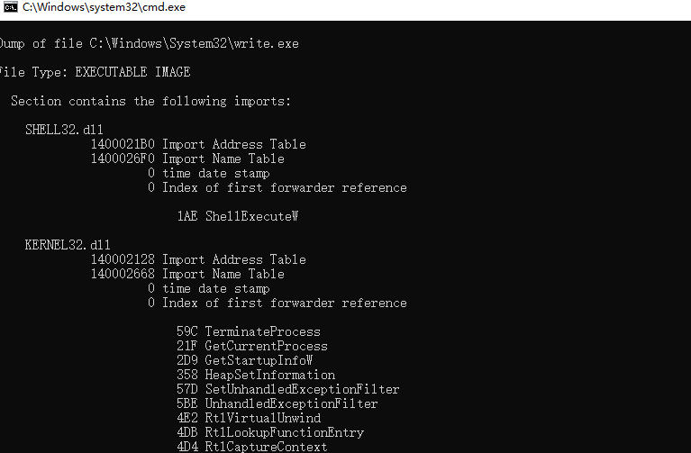

#  实验:使用DLL技术注入windows自带写字板程序 

## 实验目的

- 掌握 dll注入的原理；
- 掌握 windebug的原理与使用；
- 掌握 injectAllTheThings的原理与使用；

## 实验环境

本次实验需要使用的相关软件，版本等信息：

- windows 10
- VS2019
- winDEbug AMD64
- injectAllTheThings

  
## 实验1:借助winDEbug修改写字板程序行为


+ 第一步：dumpbin工具初步判断

  + 查阅资料后发现，在"C:\ProgramFiles\Windows NT\Accessories"目录下有write.exe对应写字板程序，但是使用VS命令提示符dumpbin失败，推测权限不足；
  在"C:\Windows\System32"目录下dumpbin成功
  ```
  dumpbin /imports C:\Windows\System32\write.exe
  ```
  
  + 查询官方文档，发现"GetSystemTimeAsFileTime"函数的作用为获取从1601年1月1日到目前经过的纳秒 ,保存到lpSystemTimeAsFileTime指向的FILETIME结构体：
  
  ```
  typedef struct _FILETIME 
  { 
   DWORD dwLowDateTime; 
   DWORD dwHighDateTime; 
  } FILETIME, *PFILETIME; 
  ```
  
  

    
  + 而写字板有显示时间的功能推测与这个函数有关，尝试进行修改
    
    

+ 第二步：使用windebug调试

  + 打开windebug，配置symbolpath
  
   
  
  + 完成后进行bp下断点。bp操作成功：
  
  
  + 查看内存数据用 d（应该是display的缩写），编辑数据用 e（应该是edit的缩写），看寄存器用r（应该是register的缩写）。
  
  
  + 使用durbp命令。写字板弹出但是无法像修改计算器时一样正常操作。提示信息为：
  ```

  jmp     qword ptr [KERNEL32!QuirkIsEnabledForPackage2Worker+0x12100 (00007fff`eadb2250)] ds:00007fff`eadb2250={KERNELBASE!GetSystemTimeAsFileTime (00007fff`e8f8e6d0)}

  ```
  查阅资料：
  ```
  dword   双字 就是四个字节
  ptr     pointer缩写 即指针
  []里的数据是一个地址值，这个地址指向一个双字型数据
  ```
  推测函数运行到这一步时,会从其他地址读取数据转换后作为时间。无法使用修改计算器的类似方法一步步调试修改时间。尝试使用IAT HOOK。

+ 第三步：尝试使用IAT hook修改时间

  + 我们可以通过api hook，改变一个系统api的原有功能。基本的方法就是通过hook“接触”到需要修改的api函数入口点，改变它的地址指向新的自定义的函数。

  + 遍历IAT结构体链表,寻找需要Hook的函数的IAT表项结构体 ;遍历IAT表,获取IAT表项结构体 ;遍历进程结构体链表,获取进程结构体信息 ;获取调试权限,获取进程句柄,写入shellcode需要的数据,重定位shellcode中的数据地址,写入shellcode并修改IAT表。在实验过程中遇到了诸多问题无法解决，IAT hook 失败。

  + 根据CSDN博客[https://bbs.huaweicloud.com/blogs/153175]中代码修改系统时间成功。IAT hook 使用不熟练，仍需学习。
  


  


## 实验2：使用injectAllTheThings_64.exe注入DLL

+ 第一步：下载injectAllTheThings仓库，编译成功。阅读官方文档用法说明

  

+ 第二步：实验前关闭windowsdefender防止拦截操作。

  

+ 第三步：打开injectAllTheThings项目，对cpp文件进行修改并重新生成dll文件。

  

+ 第四步：根据文档用法对wordpad.exe注入dll,注入成功。
  ```
  D:\study\逆向工程\injectAllTheThings-master\Release>injectAllTheThings.exe -t 1 wordpad.exe injectAllTheThings-master\Release\dllmain. dll
  ```
  
  

## 实验分析总结

  在找写字板程序本体时发现了write.exe与writepad.exe都可以调出写字板，但是两个程序所在目录不同。使用writepad.exe进行了实验。在实验过程中，加深了对DLL注入的理解，同时意识到对IAT HOOK了解不足，仍需进一步学习。借助git仓库的代码，成功实现了DLL注入。


## 实验参考
+ [git仓库]https://github.com/fdiskyou/injectAllTheThings)
+ [教学视频]
+ [CSDN论坛](blog.csdn.net/weixin_33953249/article/details/92665946)


